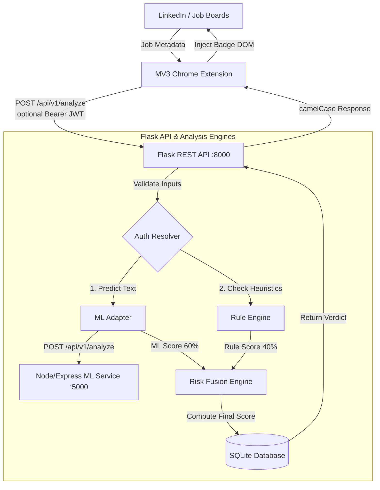
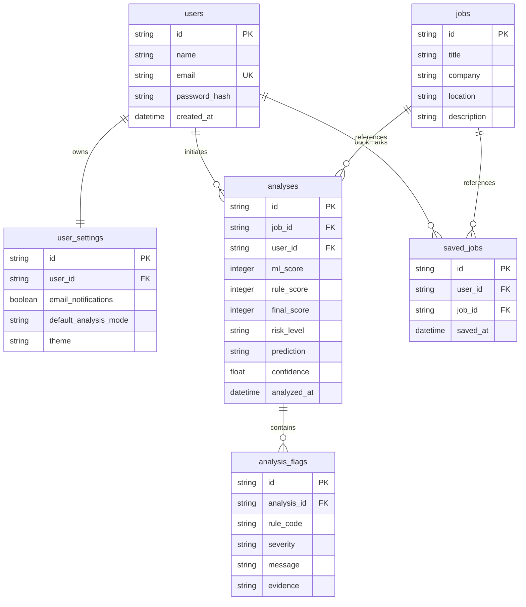

# JobShield AI — Enterprise Job Scam Detection Platform

JobShield AI is a production-grade, multi-layered job scam detection and company verification platform. It integrates a Chrome Extension (Manifest V3), a Python/Flask REST API, a Node.js/Express Machine Learning Classifier, and a React dashboard using SQLite with foreign key enforcement.

---

## 🏗️ Monorepo Workspaces & Architecture

```text
jobshield-ai/
├── apps/
│   ├── web/            # React 18 + Vite + TypeScript Frontend Dashboard
│   ├── server/         # Node.js + Express Machine Learning Classification Service
│   └── extension/      # Manifest V3 Chrome Extension (TypeScript Content & Background Scripts)
├── backend/            # Python / Flask REST API Service (Auth, Settings, Analysis Pipeline)
│   ├── app/            # Application modules (routes, services, models, utils)
│   └── tests/          # Python Unittest Suite (111 tests, including QA hardening cases)
├── packages/
│   └── ml/             # ML Model Assets & Offline Classifiers
├── package.json        # Root Monorepo configuration
└── tsconfig.json       # Strict TypeScript Compiler Options
```

### Unified Flow Architecture



---

## 🛠️ Technology Stack

- **Extension**: Manifest V3, TypeScript, Shadow DOM Badge Overlays, Background Service Workers, Local Storage.
- **Backend API**: Flask (Python 3.12+), SQLAlchemy (ORM), Alembic (Migrations), SQLite (Transactional engine).
- **ML Classifier Service**: Node.js, Express, Core ML Models.
- **Frontend Dashboard**: React 18, Vite, TypeScript, Vanilla HSL CSS variables, Glassmorphism design elements.
- **Authentication**: JWT Security (custom signatures, strict `exp`/`iat` validation claims).

---

## 🚀 Getting Started

Follow these steps to run all components locally:

### 1. Prerequisites
- **Node.js**: `v18+` and `npm` installed.
- **Python**: `3.10+` and `pip` installed.

### 2. Setup & Installation
Run dependency installations from the root folder:
```bash
# Install root & workspace packages
npm install

# Compile the shared structures
npm run build:shared
```

#### Set up Backend Python Environment:
```bash
cd backend
python -m venv venv
# Windows:
venv\Scripts\activate
# macOS/Linux:
source venv/bin/activate

pip install -r requirements.txt
flask db upgrade
```

### 3. Run Dev Servers

Start the servers in separate terminals:

#### Terminal A: Node/Express ML Classifier Service (Port 5000)
```bash
npm run dev --workspace=apps/server
```

#### Terminal B: Flask REST API Backend (Port 8000)
```bash
cd backend
# Make sure virtualenv is active
python run.py
```

#### Terminal C: React Dashboard Frontend (Port 3000)
```bash
npm run dev:web
```

#### Terminal D: Compile Chrome Extension
```bash
npm run dev:extension
```
*Load the compiled `apps/extension` folder as an **unpacked extension** in `chrome://extensions/`.*

---

## 📡 API Reference Summary

### Job Analysis Pipeline
- **`POST /api/v1/analyze`**: Performs multi-layer hybrid verification.
  - **Headers**: `Authorization: Bearer <token>` (Optional - resolves to anonymous if missing).
  - **Request Shape**:
    ```json
    {
      "title": "Data Entry Specialist",
      "company": "Fast Logistics LLC",
      "description": "Earn $50/hr. Deposit check and wire funds to vendor.",
      "location": "Remote",
      "source": "LinkedIn",
      "source_url": "https://www.linkedin.com/jobs/view/123",
      "email": "recruiter.fastlogistics@gmail.com"
    }
    ```
  - **Response Shape (`201 Created`)**:
    ```json
    {
      "success": true,
      "data": {
        "analysis_id": "ef001570-3c75-49fe-b33e-d206f347bd9c",
        "job": {
          "id": "21d53c33-0038-4deb-9358-daf6157f94ae",
          "title": "Data Entry Specialist",
          "company": "Fast Logistics LLC"
        },
        "analysis": {
          "final_score": 74,
          "risk_level": "HIGH",
          "prediction": "SUSPICIOUS",
          "confidence": 0.92,
          "explanation": "High score due to wire transfer instructions and mismatching email domain.",
          "analyzed_at": "2026-08-12T07:35:45.428458",
          "flags": [
            {
              "message": "Deposit check and wire funds instructions detected.",
              "severity": "CRITICAL",
              "evidence": "wire funds to vendor"
            }
          ]
        }
      }
    }
    ```

### Authentication
- **`POST /api/v1/auth/register`**: Creates new user profile.
- **`POST /api/v1/auth/login`**: Resolves credentials, returning JWT access token.

### User Space & Dashboard
- **`GET /api/v1/analyses`**: Paginated history of analyses owned by the user.
- **`GET /api/v1/dashboard/summary`**: Calculated aggregate counters (safe, medium, high, critical risk distributions).
- **`GET /PUT /api/v1/settings`**: Retrieves and modifies user settings (theme, analysis mode, email notifications).
- **`POST/DELETE /api/v1/jobs/<id>/save`**: Saves or removes a job bookmark.

---

## 🗄️ Database Entity-Relationship Model



---

## ⚖️ Scoring and Mappings

### Fusion Score Calculation
The final risk score is a weighted combination of the ML classifier prediction and heuristic rules matching:
$$Score_{final} = \text{round}(Score_{ML} \times 0.60 + Score_{Rules} \times 0.40)$$
- **Score Clamp**: Clamped strictly between `0` and `100`.

### Risk Level Ranges
- **LOW**: `0 - 29`
- **MEDIUM**: `30 - 59`
- **HIGH**: `60 - 79`
- **CRITICAL**: `80 - 100`

---

## 🧪 Testing Suite
Execute the python validation command inside the `backend/` workspace:
```bash
venv\Scripts\python -m unittest discover -s tests -p "test_*.py"
```
- **Total Tests**: 111
- **Status**: `OK` (All checks pass).
